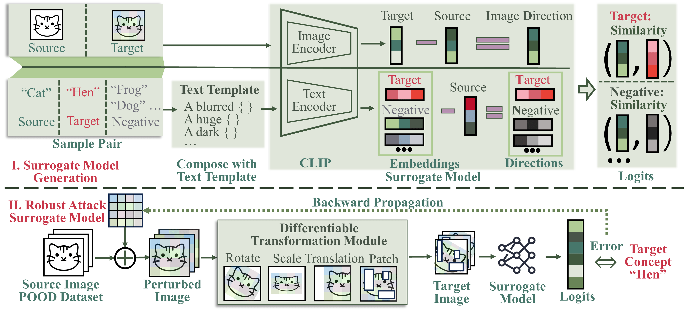

# UnivIntruder: One Surrogate to Fool Them All  
## Universal, Transferable, and Targeted Adversarial Attacks with CLIP

Deep Neural Networks (DNNs) underpin many high-stakes systems yet remain vulnerable to *unseen* adversarial and backdoor threats.  **UnivIntruder** shows how **one** publicly-available vision-language model (CLIP) can be harnessed to create *universal*, *transferable* and *targeted* perturbations that hijack completely black-box models—no architecture, weights or data access required.

<div align="center">
  
</div>

---

## ✨ Key Features

* **Universal Transferability** – a single trigger fools *dozens* of unseen classifiers (ConvNets, ViTs, MLP-Mixers…).
* **Task Hijacking by Text** – specify the malicious class with a *text prompt*; UnivIntruder aligns CLIP’s embedding space with the victim’s.
* **Data-free & Query-free** – relies only on *public* OOD images; zero queries to the protected model.
* **High Attack Success Rate** – up to **99.4 % ASR** on CIFAR-10 and **85 % ASR** on ImageNet.
* **Real-world impact** – compromises Google/Baidu Image Search and V-LLMs such as GPT-4 and Claude-3.5.

---

## 📂 Project Layout

| Path | Purpose |
|------|---------|
| `dataset/` | Dataset loaders (CIFAR-10/100, Tiny-ImageNet, Caltech-101, ImageNet). |
| `experiments/` | Command recipes, logs & configs used in the paper. |
| `robustness_evaluation/` | Scripts for Tables 8-9 (RobustBench + external defences). |
| `samples/` | Pre-trained universal triggers. |
| `utils/` | Helper functions (augmentation, logging, metrics…). |

---

## ⚙️ Environment

* **OS** Ubuntu 22.04  
* **Python** 3.10  **PyTorch** ≥ 2.1  
* **NVIDIA** GPU with ≥ 8 GB VRAM (for ImageNet runs)

```bash
conda create -n univintruder python=3.10 -y
conda activate univintruder
pip install -r requirements.txt          # includes robustbench
````

---

## 🚀 Usage

### 1  Training a Universal Perturbation

replace `/data/datasets` with your custom dataset path

```bash
python main.py \
  --tgt_dataset CIFAR10 \
  --data_path /data/datasets \
  --target 8 \
  --eps 32 \
  --pood TinyImageNet \
  --batch_size 256 \
  --max_step 5000 \
  --image_size 32
```

### 2  Standard Evaluation

```bash
python evaluate.py \
  --tgt_dataset CIFAR10 \
  --data_path /data/datasets \
  --ckpt samples/triggers/cifar10_32_255.pth \
  --target 8 \
  --eps 32 \
  --image_size 32
```

### 3  Quick Start with Pretrained Models

```python
import torch
trigger = torch.load('samples/triggers/cifar10_32_255.pth')
adv_img = (img + trigger).clamp(-1, 1)   # img ∈ [-1, 1]
```

<div align="center">
  
</div>

---

## 🔁 Reproducing Paper Results

### Table 3 – Cross-model Transferability

```bash
python evaluate.py \
  --tgt_dataset ImageNet \
  --data_path /data/datasets \
  --ckpt samples/triggers/imagenet_32_255.pth \
  --target 8 --eps 32 --image_size 224
```

Replace `ImageNet` by `CIFAR10`, `CIFAR100` or `Caltech101` and use the matching checkpoint in `samples/triggers/` to reproduce other rows.

### Table 2 – Varying Target Class

```bash
for T in 1 3 5 7 9; do
  python evaluate.py \
    --tgt_dataset CIFAR10 \
    --data_path /data/datasets \
    --ckpt samples/triggers/cifar10_32_255_target_${T}.pth \
    --target $T --eps 32 --image_size 32;
done
```

### Figure 4 – Varying Perturbation Budget

```bash
for E in 8 16 24 32; do
  python evaluate.py \
    --tgt_dataset CIFAR10 \
    --data_path /data/datasets \
    --ckpt samples/triggers/cifar10_${E}_255.pth \
    --target 8 --eps $E --image_size 32;
done
```

### Table 7 – Different VLP Surrogates

```bash
# Train with SigLIP
python main_siglip.py \
  --tgt_dataset CIFAR10 --data_path /data/datasets \
  --target 8 --eps 32 --pood TinyImageNet \
  --batch_size 256 --max_step 5000 --image_size 32
```

```bash
# Evaluate ImageBind-based trigger on ImageNet
python evaluate.py \
  --tgt_dataset ImageNet --data_path /data/datasets \
  --ckpt samples/triggers/imagenet_32_255_imagebind.pth \
  --target 8 --eps 32 --image_size 224
```

### Tables 8 – Robust Defences

```bash
python evaluate_robustness_c10.py \
  --tgt_dataset CIFAR10 --data_path /data/datasets \
  --ckpt samples/triggers/cifar10_32_255.pth \
  --target 8 --eps 32 --image_size 32
```

---

## 📜 Citation

```bibtex
@inproceedings{xu2025univintruder,
  title={One Surrogate to Fool Them All: Universal, Transferable, and Targeted Adversarial Attacks with CLIP},
  author={Xu, Binyan and Dai, Xilin and Tang, Di and Zhang, Kehuan},
  booktitle={Proceedings of the 2025 on ACM SIGSAC Conference on Computer and Communications Security},
  year={2025}
}
```

---

© 2025 UnivIntruder Authors — MIT License
