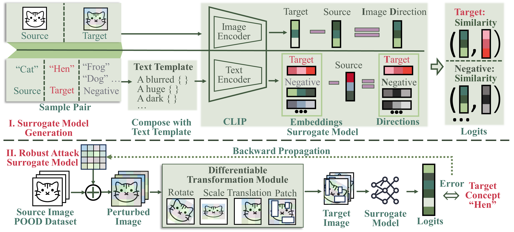
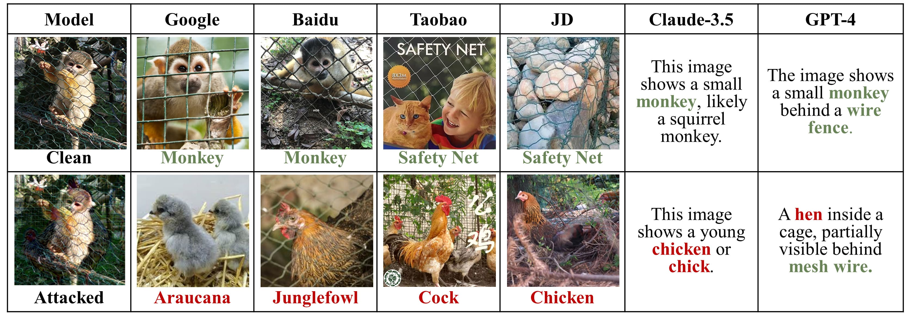

# UnivIntruder Framework

## Overview
Deep Neural Networks (DNNs) play critical roles in various high-stakes applications but are susceptible to adversarial and backdoor attacks. Traditional attack methods are becoming less effective as companies adopt more secure practices, such as closed-source data and black-box models. UnivIntruder, our novel framework, leverages universal transferable vulnerabilities without requiring direct access to the target models or datasets. It introduces a unique attack strategy called "task hijacking," utilizing textual concepts to induce misclassification across multiple networks. This paper explores the development and extensive evaluation of UnivIntruder across different DNN architectures and defensive mechanisms.



## Key Features
- **Universal Transferability:** Exploits shared vulnerabilities across diverse DNNs using publicly available vision-language models like CLIP.
- **Task Hijacking:** A novel method that uses textual triggers to manipulate model behavior across different tasks and domains.
- **High Attack Success Rate (ASR):** Achieves up to 99.4\% ASR on CIFAR-10 and robust performance against conventional defenses.
- **Real-World Applicability:** Demonstrates effective attacks on platforms like Google Image Search and Baidu Image Search, and large language models like GPT-4.

## File Structure
- `dataset/`: Scripts for dataset handling and manipulation.
- `experiments/`: Detailed records and configurations for each experimental setup.
- `samples/`: Pretrained weights and sample attack triggers for quick evaluations.
- `utils/`: Utility scripts for data preprocessing, transformation, and more.

## Environment Setup
- **Python Version:** Python 3.10
- **Operating System:** Ubuntu 22.04 LTS
- **Package Manager:** Conda

### Installation
Install the required packages using the provided requirements file:
```bash
conda create --name myenv python=3.10
conda activate myenv
pip install -r requirements.txt
```

## Usage
### Training
Automatically downloads and configures CIFAR10, CIFAR100, and Tiny ImageNet datasets for out-of-distribution analysis:
```bash
python main.py
```
This script sets up an attack using Tiny ImageNet as the POOD dataset with target class 8 under an L-infinity norm of 32/255.

### Evaluation
Evaluate the effectiveness of the developed triggers against a variety of defense mechanisms:
```bash
python evaluate.py
```
Assesses pretrained models under attack conditions detailed in our experiments.

### Quick Start with Pretrained Models



Load and deploy pretrained models from `samples/triggers`:
```python
import torch
a = torch.load('cifar10_32_255.pth')
img = img + a  # img should be a tensor in the range [-1, 1]
img = torch.clamp(img, -1, 1)
```

## Contributing
Contributions to UnivIntruder are welcome! Please read our contributing guidelines to get started.

## Citation
If you use UnivIntruder in your research, please cite our paper:
```
[citation here]
```
